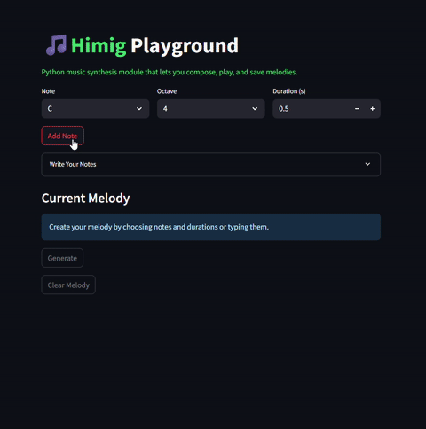

<a href="https://coff.ee/jncel">
  
</a>

---

# Himig

**himig** is a python music synthesis module that lets you compose, play, and save melodies.

---

## Features

- 🎵 **Compose melodies** using note names and durations (e.g., `"C4:0.5"`)
- 🔊 **Play** melodies directly on your system’s audio output
- 💾 **Save** melodies as standard WAV files
- 🧑‍💻 **Generate in-memory WAV bytes** for web apps (e.g., Streamlit)
- 🎼 **Sample built-in melodies**: Happy Birthday, Twinkle Twinkle.
- 🪶 **Lightweight**: Only depends on [numpy](https://numpy.org/)

---

## Demo



## Installation

```sh
pip install himig
```

Or, for development:

```sh
git clone https://github.com/j-ncel/himig.git
cd himig
```

---

## Quick Start

### Play a Melody

```python
from himig import play

melody = ["C4:0.5", "C4:0.5", "G4:1.0"]
play(melody)
```

### Save a Melody as WAV

```python
from himig import save

melody = ["C4:0.5", "C4:0.5", "G4:1.0"]
save(melody, "happy.wav")
```

### Use Built-in Melodies

```python
from himig import play, happy_birthday, twinkle_twinkle

play(happy_birthday)
play(twinkle_twinkle)
```

### Use in Streamlit or Web Apps

```python
import streamlit as st
from himig import generate_wav_bytes, happy_birthday

wav_bytes = generate_wav_bytes(happy_birthday)
st.audio(wav_bytes, format="audio/wav")
```

---

## Melody Format

- Each melody is a list of strings: `"NOTE:DURATION"`
  - `NOTE`: Note name (e.g., `C4`, `F#5`, `Bb3`, or `R` for rest)
  - `DURATION`: Length in seconds (float or int)
- Example: `["C4:0.5", "G4:1.0", "R:0.25"]`

---

## Built-in Melodies

- `happy_birthday`
- `twinkle_twinkle`

You can import them directly:

```python
from himig import happy_birthday, twinkle_twinkle
```

You can contribute more melodies to the project, it is welcome!

---

## API Reference

### `play(melody, sample_rate=44100, amplitude=32767)`

Play a melody through your system’s audio output.

- `melody`: List of note-duration strings
- `sample_rate`: Audio sample rate (Hz)
- `amplitude`: Peak amplitude

---

### `save(melody, filename, sample_rate=44100, amplitude=32767)`

Save a melody as a WAV file.

- `melody`: List of note-duration strings
- `filename`: Output WAV file path

---

### `generate_wav_bytes(melody, sample_rate=44100, amplitude=32767)`

Generate a WAV file as an in-memory bytes buffer (for web apps).

- Returns: `io.BytesIO` object

---

## Adding Your Own Melodies

Just create a list of note-duration strings:

```python
my_song = [
    "C4:0.5", "D4:0.5", "E4:1.0", "R:0.25", "E4:0.5", "D4:0.5", "C4:1.0"
]
play(my_song)
```

---

## Project Structure

```
himig/
│
├── himig/
│   ├── __init__.py
│   ├── core.py
│   ├── audio_player.py
│   ├── constants.py
│   └── melodies.py
├── playground/
│   ├── st=playground.py
│   └── sample-video.mp4
├── tests/
│   └── test_himig.py
├── README.md
├── pyproject.toml
└── LICENSE
```

---

## Links

- [GitHub Repository](https://github.com/j-ncel/himig)
- [PyPI Package](https://pypi.org/project/himig/)
